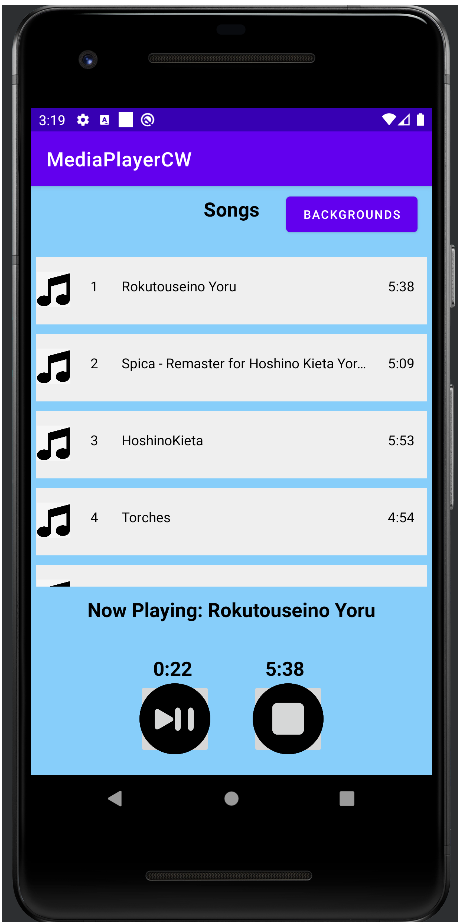
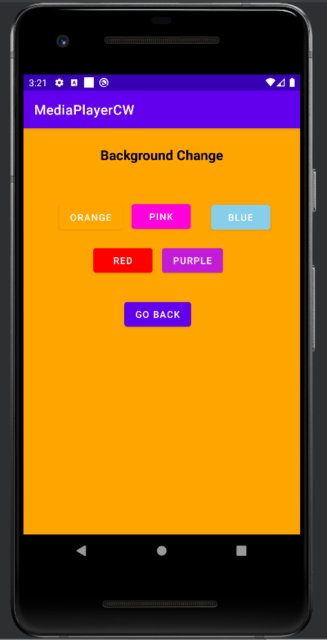

# MDP-CW-MusicPlayer
## Mobile Device Programming First Android App Music Player

Tested in Pixel 2 API 29 
Loads songs in your phone and plays the song when you click on it,can be paused and stopped. the background color can be changed

